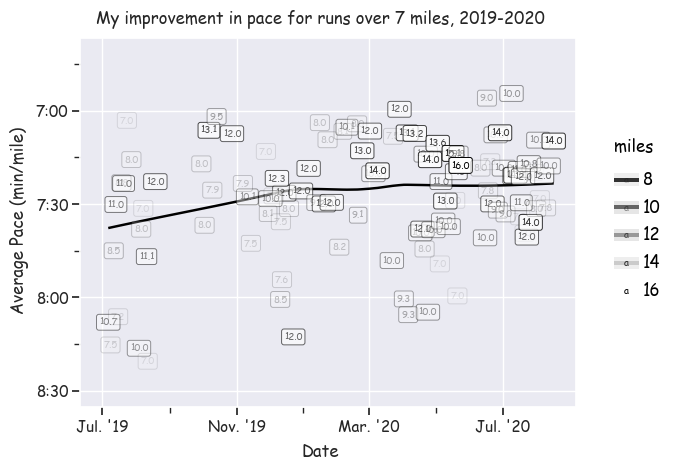

## A visual representation of how my running has improved over about a year

Intuitively, I knew that I have begun to run both faster and longer
over the course of this past year. However, I wanted to prove it with the 
data I have thanks to tracking every run with a Garmin watch, and uploading
 that data to Strava. I downloaded my Strava data archive and then continued from there.
 
I decided to keep it simple: I am not accounting for weather, for time of day,
 for whether or not I was doing workouts during a given week, or any other potential factors.
 This was, of course, for simplicity, but also for accuracy concerns. Because I am
 so close to this data, I know that there are days in there where I was running through
 a significant amount of snow, days where I stopped 5 times in the middle of my run at stoplights
 or bathrooms, and so on. There are so many confounding factors that are not captured by my Strava
 data that it didn't feel right to choose some to control for over others. So in a sense,
 presenting the data in this raw form acknowledges that, on any given day,
 there are a multitude of different factors present that either made that run easier or harder than 
 "average".
 
 Despite these considerations, the trend is clear: I am, indeed, running faster and longer than I was a year ago and 
 the trend continues upwards. 